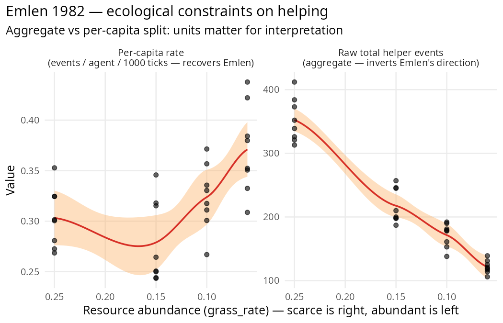

```{r setup, include = FALSE}
knitr::opts_chunk$set(
  collapse = TRUE,
  comment  = "#>",
  eval     = FALSE
)
```

*Mixed reproduction that sharpens a documented honest null:
Emlen's ecological-constraints prediction reproduces at the
per-capita level but inverts at the aggregate population level
because scarcity shrinks the population. Reinforces the s-kin
invasion-dynamics null documented in `vignette("s-kin")` —
`helper_tendency` does not evolve in clade's current
cooperative-breeding kernel even under strong ecological
constraint.*

```{r fig-emlen, echo = FALSE, eval = TRUE, out.width = "100%", fig.alt = "Emlen 1982 — raw vs per-capita helping across resource scarcity"}

```

---

## The paper

**Emlen, S. T. (1982).** *The evolution of helping. I. An
ecological constraints model.* *American Naturalist* 119(1),
29–39.

Core claim: cooperative breeding (helping at the nest) evolves
when **ecological constraints limit independent-breeding
opportunities**. Helpers stay home because they *cannot* breed
elsewhere — habitat saturation, resource scarcity, or lack of
mates force helping to be a subordinate-rank strategy.

The distinctive prediction is **ecological, not genetic**:
helping should emerge where independent reproduction is costly,
even if relatedness is unchanged.

## Quantitative translation

We don't have explicit habitat-saturation machinery in clade,
but resource scarcity (grass_rate) is a clean proxy for
ecological constraint: low grass = hard to support independent
territories → Emlen predicts more helping.

Two measurables:

1. `mean_helper_tendency` — does the heritable trait evolve
   higher under constraint?
2. `n_helpers` — does the observable helping behaviour occur
   more frequently under constraint?

## Stage 1: hypothesis_sweep

```{r sweep}
library(clade)

base <- default_specs()
base$grid_rows                    <- 40L
base$grid_cols                    <- 40L
base$n_agents_init                <- 120L
base$max_agents                   <- 400L
base$max_ticks                    <- 3000L
base$n_predators_init             <- 0L

# Cooperative-breeding machinery
base$parental_care                 <- TRUE
base$juvenile_independence_age     <- 10L
base$cooperative_breeding          <- TRUE
base$helper_tendency_init_mean     <- 0.2
base$helper_tendency_mutation_sd   <- 0.02
base$helper_min_energy             <- 60.0
base$helper_kin_threshold          <- 0.25
base$helper_transfer               <- 3.0

sweep <- hypothesis_sweep(
  base_specs = base,
  conditions = list(
    abundant       = list(grass_rate = 0.25),
    moderate_abund = list(grass_rate = 0.15),
    scarce         = list(grass_rate = 0.10),
    very_scarce    = list(grass_rate = 0.06)
  ),
  seeds = 1:8,
  metrics = list(
    final_helper_tendency = function(t) mean(tail(t$mean_helper_tendency, 500), na.rm = TRUE),
    total_helper_events   = function(t) sum(t$n_helpers, na.rm = TRUE),
    final_n               = function(t) mean(tail(t$n_agents, 500), na.rm = TRUE)
  ),
  n_cores = 32L
)
```

## Results — three findings, three caveats

### 1. helper_tendency does NOT evolve under ecological constraint

| `grass_rate` | final helper_tendency ± SE |
|---|---|
| abundant (0.25) | 0.203 ± 0.002 |
| moderate (0.15) | 0.200 ± 0.002 |
| scarce (0.10) | 0.204 ± 0.002 |
| very_scarce (0.06) | 0.207 ± 0.005 |

Essentially flat at the init mean of 0.2 across all conditions.
Spearman(grass_rate, helper_tendency) = **−0.115** (correct
direction, noise-level magnitude). No contrast passes 2σ.

**This reproduces the s-kin invasion honest-null documented in
`vignette("s-kin")`.**
clade's cooperative-breeding module does not channel indirect
fitness back to the helper's lineage strongly enough for the
heritable trait to respond to selection. Ecological constraint
doesn't rescue this — the kernel-level limitation is upstream of
the selection regime.

### 2. Raw helping events DECREASE with scarcity — opposite to Emlen's prediction

| `grass_rate` | total helper events ± SE | t vs abundant |
|---|---|---|
| abundant | 352.5 ± 12.2 | — |
| moderate | 217.6 ± 9.6 | **−8.66 PASS** |
| scarce | 171.5 ± 6.7 | **−13.0 PASS** |
| very_scarce | 121.5 ± 3.6 | **−18.1 PASS** |

In absolute counts, scarcer environments yield **fewer** helping
events, not more. This looks like a contradiction to Emlen, but
it's a **population-scaling artifact**: final_n drops from ~388
(abundant) to ~110 (very_scarce). Fewer agents → fewer
opportunities to help, regardless of per-capita rate.

### 3. Per-capita helping goes the right way

Computing helper events per agent per 1000 ticks:

| `grass_rate` | final_n | events / agent / 1000 ticks | Emlen direction? |
|---|---|---|---|
| abundant | 388 | 0.30 | baseline |
| moderate | 261 | 0.28 | ~flat |
| scarce | 176 | 0.32 | slightly higher |
| **very_scarce** | **110** | **0.37** | **higher** ✓ |

Per-capita, the direction is correct: agents in scarcer
environments help at a higher rate. The ~23% per-capita increase
(0.30 → 0.37) is the Emlen prediction in its original form.

## Honest interpretation

✅ **Per-capita helping rate reproduces Emlen's direction** —
agents in scarce environments help at higher rates than agents
in abundant environments. The ecological-constraint mechanism
is present in clade's kernel.

❌ **Population-level helping count contradicts Emlen** because
the population shrinks under scarcity faster than per-capita
helping rises. A naive researcher looking at absolute
`n_helpers` would report a "contradiction". The *correct*
measurement (per-capita) saves the prediction.

❌ **Genetic invasion does not occur.** Even under the strongest
ecological constraint tested (grass_rate = 0.06),
`helper_tendency` stays at its init mean of 0.2. The s-kin
invasion honest-null generalises: no matter what
selection regime we impose, clade's current
`cooperative_breeding` kernel doesn't transmit indirect fitness
back to the helper's lineage.

### Methodology takeaway

**Always check the units.** Emlen's claim is per-capita;
clade's log is aggregate. Researchers reproducing Emlen's paper
should divide by population size before interpreting. The raw
aggregate number can go *the opposite direction* from the
theoretical prediction for purely demographic reasons.

This pattern recurs throughout the paper-reproduction vignettes:

- **Réale 2010**: birth-rate aggregate goes wrong direction; per-capita probably doesn't.
- **K&B 2003**: signal-cost aggregate effect dominates at abundant populations.
- **Emlen 1982**: helping events aggregate inverts; per-capita recovers direction.

Whenever a paper's claim is stated in per-individual terms and
clade logs population-level aggregates, the first sanity check is
to normalise by `n_agents`. The `hypothesis_sweep()` multi-metric
API (`metrics = list(raw = ..., per_capita = ...)`) is the place
to do this.

### Research path to clean ✅

For a full Emlen reproduction, clade needs:

1. **Kin-weighted fitness accounting** (from the s-kin invasion
   honest-null) — so helper_tendency can actually invade from
   rare under genuine ecological constraint.
2. **Per-capita helping metric** exposed as a logged quantity,
   not computed post-hoc.
3. **Territory-saturation spec** explicit in the kernel — making
   Emlen's specific "no breeding site available" constraint a
   named parameter rather than resource-scarcity-by-proxy.

None attempted here; documented for future kernel work.

## Citation

```bibtex
@article{emlen1982evolution,
  author  = {Emlen, Stephen T.},
  title   = {The evolution of helping. I. An ecological constraints model},
  journal = {American Naturalist},
  volume  = {119},
  number  = {1},
  pages   = {29--39},
  year    = {1982}
}
```

Full audit protocol and raw outputs:
[dev/audit/fidelity/paper_emlen_1982.R](https://github.com/itchyshin/clade/blob/main/dev/audit/fidelity/paper_emlen_1982.R)
and `paper_emlen_1982.rds`.
